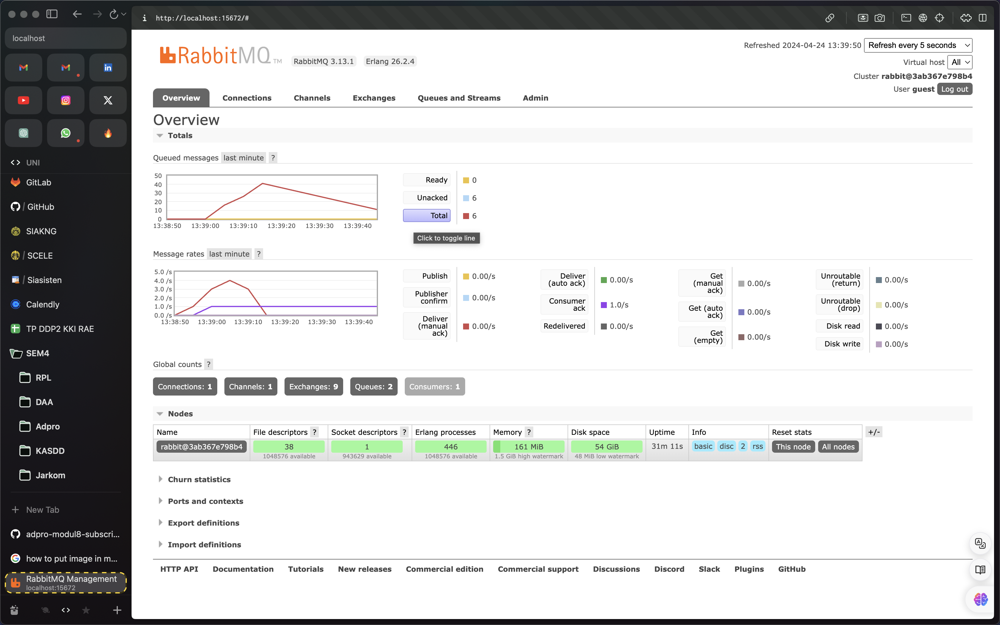
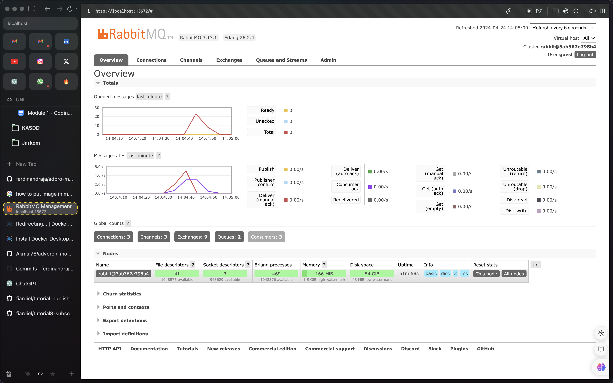

# ADVPROG Module 8 - Subscriber

## What is AMQP?

AMQP, or the Advanced Message Queuing Protocol (AMPQ), acts as a crucial network communication protocol facilitating the seamless exchange of messages between diverse applications, organizations, or components. Its functionality extends to supporting programming load balancing and monitoring, achieved through the distinct separation of exchanges (where producers dispatch messages) and queues (where consumers retrieve them).

Within the main.rs file, the implementation of AMQP for message queuing is evident, establishing a vital connection between the UserCreatedHandler and the main via the CrosstownBus. Notably, the UserCreatedHandler stands ready to intercept messages directed to the "user_created" topic queue, enabling efficient handling of pertinent information.

## What about guest:guest@localhost:5672?

1. The first guest refers to the default username assigned to the RabbitMQ server
2. The second guest refers to the default password assigned to the RabbitMQ server
3. The localhost refers to the default hostname of the RabbitMQ server
4. The 5672 refers to the default port number of the RabbitMQ server

## Slow subscriber

It is showed that the queueed message hits 40. This happens because the subscriber is slow to process the message. The subscriber is slow because it sleeps for 1 second before processing the message.

## 1 publisher 3 Subscriber

We can see that the queue is not as much as the first one. This is because the message is distributed to 3 subscribers. The message is distributed to the subscriber in a round-robin fashion. This means that the message is distributed to the subscriber in a sequential manner. The first message is distributed to the first subscriber, the second message is distributed to the second subscriber, and the third message is distributed to the third subscriber. This process is repeated until all the messages are distributed to the subscriber.
